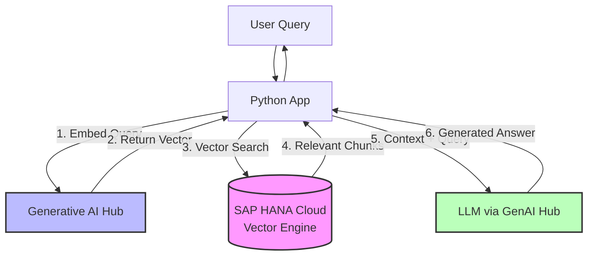

# Learning Hub - Complete Tutorial Guide

## Overview

This comprehensive guide provides hands-on tutorials for mastering AI business solutions on SAP Business Technology Platform (BTP). The tutorials progress from foundational concepts to advanced implementations, enabling developers and architects to build production-ready AI applications.

---

## Tutorial 1: Getting Started with SAP BTP Trial

**Level**: Beginner | **Duration**: 15 minutes | **Prerequisites**: None

### Learning Objectives

After completing this tutorial, you will be able to:
- Create and activate a SAP BTP trial account
- Navigate the SAP BTP cockpit interface
- Understand the global account and subaccount hierarchy
- Provision AI services for development

### Introduction

SAP Business Technology Platform (BTP) is SAP's comprehensive cloud platform that combines database and data management, analytics, application development, and integration capabilities. The trial account provides free access to explore these services for 30 days.

### Step-by-Step Instructions

**Step 1: Create Your SAP BTP Trial Account**

Navigate to [https://account.hanatrial.ondemand.com](https://account.hanatrial.ondemand.com) and click the "Register" button. You will be prompted to enter your email address, create a password, and accept the terms and conditions. After registration, you will receive a confirmation email. Click the verification link in the email to activate your account.

**Step 2: Access the SAP BTP Cockpit**

Log in to your trial account using your credentials. You will be directed to the SAP BTP Cockpit, which serves as your central hub for managing cloud resources, services, and applications.

**Step 3: Explore Your Global Account**

In the cockpit, you will see your "Global Account" listed in the left navigation panel. This is your top-level container in SAP BTP. Click on it to view its details. The global account contains one or more subaccounts, which are logical groupings of resources.

**Step 4: Navigate to Your Subaccount**

Your trial account includes one pre-configured subaccount. Click on it to enter. Within the subaccount, you can manage services, applications, users, and security settings. This is where you will provision AI services.

**Step 5: Access the Service Marketplace**

From your subaccount dashboard, click on "Services" in the left navigation, then select "Service Marketplace". This displays all available SAP BTP services that you can provision.

**Step 6: Provision AI Core**

Search for "SAP AI Core" in the Service Marketplace. Click on it to view details. Select the appropriate plan (the free tier is suitable for trials). Click "Create" to provision the service. The system will display a confirmation message and begin provisioning the service in the background.

**Step 7: Provision Generative AI Hub**

Repeat the process for "Generative AI Hub". Search for it in the Service Marketplace, select the plan, and click "Create".

**Step 8: Verify Provisioning Status**

Wait 2-3 minutes for the services to complete provisioning. Navigate to "Instances and Subscriptions" in your subaccount. You should see both "SAP AI Core" and "Generative AI Hub" listed with a status of "Active" or "Subscribed".

### Key Concepts

**Global Account**: Your top-level container in SAP BTP, representing your organization's account. All subaccounts and resources belong to a global account.

**Subaccount**: A logical grouping of resources within your global account. Each subaccount is independent and can have its own users, services, and applications.

**Service Marketplace**: The central location where you discover, provision, and manage SAP BTP services. Services can be provisioned on-demand.

**Instance**: A running instance of a provisioned service. For example, an instance of SAP AI Core represents an active AI runtime environment.

### Troubleshooting

If you encounter issues during provisioning, check the following:
- Ensure your email address is verified by clicking the link in the confirmation email
- Verify that your trial account has not expired (trial accounts are valid for 30 days)
- Check that you have sufficient quota for the services you are provisioning
- Clear your browser cache and try again if the cockpit is not loading correctly

### Next Steps

Once your AI services are provisioned, proceed to Tutorial 2 to explore the Generative AI Hub and learn how to interact with Large Language Models.

---

## Tutorial 2: Exploring the Generative AI Hub Playground

**Level**: Beginner | **Duration**: 20 minutes | **Prerequisites**: Completed Tutorial 1

### Learning Objectives

After completing this tutorial, you will be able to:
- Access and navigate the Generative AI Hub interface
- Understand the capabilities of different Large Language Models (LLMs)
- Craft effective prompts for various use cases
- Experiment with prompt engineering techniques

### Introduction

The Generative AI Hub is a central interface within SAP BTP that provides access to a variety of Large Language Models from leading providers. These models can generate text, code, summaries, and more based on your input prompts. The hub includes a playground where you can experiment with prompts before integrating them into applications.

### Available Models

The Generative AI Hub provides access to several LLMs, each with different strengths:

| Model | Provider | Strengths | Best For |
|-------|----------|-----------|----------|
| GPT-4 | OpenAI | General-purpose reasoning, creative writing, complex analysis | Most use cases, creative tasks |
| Claude | Anthropic | Long-context understanding, nuanced analysis, safety | Analysis, summarization, research |
| SAP-RPT-1 | SAP | Predictive insights, business analytics | Business intelligence, forecasting |
| SAP-ABAP-1 | SAP | ABAP code generation and understanding | SAP development, code optimization |

### Understanding LLM Deployment Architecture

Before exploring the Generative AI Hub, it's important to understand how LLMs are deployed on SAP BTP. The deployment architecture consists of several layers:

**Model Layer**: The actual LLM (e.g., GPT-4, Claude, SAP-specific models) running on inference servers. SAP BTP integrates with multiple model providers through a unified API.

**API Layer**: The Generative AI Hub exposes a REST API that abstracts away the complexity of different model providers. Your applications call this single API regardless of which underlying model you use.

**Orchestration Layer**: SAP AI Core manages model lifecycle, scaling, and resource allocation. It automatically scales inference servers based on demand and handles failover if a model becomes unavailable.

**Integration Layer**: The hub integrates with SAP HANA Cloud for vector storage, SAP Document AI for preprocessing, and SAP Build for workflow orchestration.

### Step-by-Step Instructions

**Step 1: Access the Generative AI Hub**

From your SAP BTP subaccount, navigate to "Instances and Subscriptions". Locate "Generative AI Hub" in the list and click the link to open it. You will be directed to the hub's interface.

**Step 2: Explore Available Models**

In the hub's main interface, you will see a list of available LLMs. Click on each model to view its description, capabilities, and pricing information. Take note of the models' strengths and limitations.

**Step 3: Create Your First Prompt**

Select "GPT-4" as your model. Click "Create New Prompt" to open the prompt editor. In the text field, enter the following prompt:

```
Explain how SAP BTP AI Core can help a retail business optimize inventory management. 
Provide a concise explanation in 2-3 paragraphs.
```

Click "Execute" to send the prompt to the model. The model will generate a response within seconds.

**Step 4: Analyze the Response**

Review the generated response. Notice how the model understood your request and provided relevant information about SAP BTP AI Core in the context of retail inventory management. The response demonstrates the model's ability to provide contextual, business-relevant answers.

**Step 5: Refine Your Prompt**

Experiment with different prompt styles to see how they affect the model's responses. Try the following variations:

**Specific Prompt**: "Write a Python script that connects to SAP BTP AI Core using the REST API and sends a prompt to the Generative AI Hub. Include error handling."

**Contextual Prompt**: "As a SAP solution architect with 10 years of enterprise software experience, explain the key benefits of using SAP AI Foundation for building enterprise AI applications."

**Structured Prompt**: "Create a JSON schema for a customer sentiment analysis API that integrates with SAP BTP. Include fields for customer ID, sentiment score, and confidence level."

**Step 6: Explore Prompt Templates**

The hub provides pre-built templates for common tasks. Click on "Templates" to browse examples such as "Code Generation", "Data Analysis", "Business Writing", and "Customer Service". These templates demonstrate best practices for prompt engineering.

**Step 7: Experiment with Parameters**

Some models allow you to adjust parameters that affect the response:

- **Temperature** (0-1): Controls randomness. 0 = deterministic, 1 = creative. For technical tasks, use lower values (0.2-0.5). For creative tasks, use higher values (0.7-1.0).
- **Max Tokens**: Limits the length of the response. Useful for controlling costs and response length.
- **Top-P (Nucleus Sampling)**: Controls diversity. Lower values (0.5-0.7) produce more focused responses.

Adjust these parameters and observe how they affect the model's output.

### Deploying Custom LLMs to SAP AI Core

While the Generative AI Hub provides access to pre-trained models, you can also deploy custom fine-tuned models to SAP AI Core. This is useful when you have domain-specific models or want to optimize for your specific use case.

**Step 1: Prepare Your Model**

Your custom model should be in a standard format (ONNX, TensorFlow SavedModel, or PyTorch). Package it with a serving framework like vLLM or TensorFlow Serving.

**Step 2: Create a Docker Image**

Create a Dockerfile that packages your model and serving framework:

```dockerfile
FROM nvidia/cuda:11.8.0-runtime-ubuntu22.04

WORKDIR /app

# Install vLLM
RUN pip install vllm

# Copy your model
COPY ./my-model /app/model

# Expose port
EXPOSE 8000

# Start vLLM server
CMD ["python", "-m", "vllm.entrypoints.api_server", "--model", "/app/model", "--port", "8000"]
```

**Step 3: Push to Container Registry**

```bash
docker build -t my-registry/my-llm:v1 .
docker push my-registry/my-llm:v1
```

**Step 4: Deploy to SAP AI Core**

Create a deployment manifest:

```yaml
apiVersion: ai.sap.com/v1
kind: Model
metadata:
  name: my-custom-llm
spec:
  image: my-registry/my-llm:v1
  replicas: 2
  resources:
    requests:
      memory: "16Gi"
      cpu: "4"
      nvidia.com/gpu: "1"
  env:
    - name: MODEL_NAME
      value: "my-model"
    - name: MAX_TOKENS
      value: "2048"
```

Deploy using SAP AI Core CLI:

```bash
sap-ai-core deploy -f deployment.yaml
```

### Best Practices for Prompt Engineering

**Be Specific**: Clear, detailed prompts produce better results. Instead of "Explain SAP BTP", try "Explain how SAP BTP's AI Core service enables enterprises to deploy custom machine learning models at scale."

**Provide Context**: Tell the model your use case, audience, and requirements. For example: "Explain SAP BTP AI Core to a business analyst who has no technical background, using simple language and real-world examples."

**Use Examples**: Show the model what you want with few-shot prompting. Provide 1-2 examples of the desired output format before asking for the actual task.

**Iterate**: Refine prompts based on responses. If the first response is not satisfactory, adjust your prompt and try again.

**Specify Output Format**: Request specific formats such as JSON, markdown tables, or bullet points to make responses easier to parse and use.

**Cost Optimization**: Monitor token usage and implement caching for frequently asked questions. Use smaller models for simple tasks and reserve larger models for complex reasoning.

### Key Concepts

**Large Language Model (LLM)**: An AI model trained on vast amounts of text data to understand and generate human language. LLMs can perform a wide range of tasks including summarization, translation, question answering, and code generation.

**Prompt**: The input text you provide to an LLM. Well-crafted prompts are crucial for obtaining high-quality responses.

**Token**: A unit of text that an LLM processes. Roughly equivalent to 4 characters or 1 word. Understanding token counts helps manage API costs.

**Temperature**: A parameter that controls the randomness of an LLM's responses. Lower values produce more predictable outputs, while higher values produce more creative outputs.

**Prompt Engineering**: The practice of crafting prompts to elicit desired responses from LLMs. This is a key skill for working with generative AI.

### Troubleshooting

If you encounter issues:
- Verify that your Generative AI Hub subscription is active in your subaccount
- Check that you have sufficient API quota for your trial account
- If responses are slow, the service may be under high load. Try again in a few moments
- If a model is unavailable, it may be temporarily offline. Try a different model or check the service status

### Monitoring and Managing Deployed Models

Once your models are deployed, monitor their performance using SAP AI Launchpad:

**Key Metrics to Track**:
- **Latency**: Average response time per request
- **Throughput**: Requests processed per second
- **GPU Utilization**: Percentage of GPU resources in use
- **Error Rate**: Percentage of failed requests
- **Cost**: Estimated cost based on compute resources and API calls

Use these metrics to optimize your deployment by adjusting replica counts, model sizes, or hardware allocation.

### Next Steps

In Tutorial 3, you will learn how to build a Retrieval-Augmented Generation (RAG) solution with SAP HANA Vector Engine that combines your business data with LLM capabilities to provide contextual, accurate answers.

---

## Tutorial 3: Building a Retrieval-Augmented Generation (RAG) Solution

**Level**: Intermediate | **Duration**: 45 minutes | **Prerequisites**: Completed Tutorials 1-2

### Learning Objectives

After completing this tutorial, you will be able to:
- Understand RAG architecture and its benefits
- Set up a document repository on SAP BTP
- Integrate SAP Document AI for information extraction
- Query your business data with LLM-powered contextual answers

### Introduction

Retrieval-Augmented Generation (RAG) is a technique that combines information retrieval with generative AI. Instead of relying solely on an LLM's training data, RAG systems retrieve relevant documents from your business data and use them as context for generating answers. This approach provides more accurate, contextual, and up-to-date responses.

### RAG Architecture with SAP HANA Vector Engine

A production-grade RAG system on SAP BTP consists of several integrated components:

**Document Store**: Your business documents (PDFs, Word files, databases, etc.) stored in SAP HANA Cloud with vector embeddings.

**Vector Database**: SAP HANA Cloud's Vector Engine stores high-dimensional embeddings and performs fast similarity search. HANA's vector capabilities include:
- **Vector Data Types**: Native support for dense vectors up to 65,536 dimensions
- **Similarity Search**: Cosine similarity, Euclidean distance, and dot product operations
- **Approximate Nearest Neighbor (ANN)**: Fast retrieval using HNSW (Hierarchical Navigable Small World) algorithm
- **Hybrid Search**: Combine vector similarity with traditional SQL filters

**Embedding Service**: Converts documents and queries into numerical vectors using models like OpenAI's text-embedding-3-large or SAP's proprietary embeddings.

**LLM Integration**: The Generative AI Hub provides LLM access for answer generation.

**Orchestration**: SAP AI Core manages the entire RAG pipeline, including embedding generation, vector search, and LLM calls.



### RAG Workflow with SAP HANA Vector Engine

The complete workflow is:

1. **Ingestion Phase**: Documents are uploaded and processed
2. **Chunking**: Large documents are split into manageable chunks (typically 512-1024 tokens)
3. **Embedding**: Each chunk is converted to a vector using an embedding model
4. **Storage**: Vectors and metadata are stored in SAP HANA Vector Engine
5. **Query Phase**: User asks a question
6. **Query Embedding**: The question is converted to a vector using the same embedding model
7. **Vector Search**: HANA performs similarity search to find the most relevant chunks
8. **Context Assembly**: Retrieved chunks are assembled into a context window
9. **LLM Generation**: The Generative AI Hub generates an answer based on the context
10. **Response**: The answer is returned to the user

### Step-by-Step Instructions

**Step 1: Prepare Your Documents**

Gather business documents that you want to make searchable. Examples include:
- Product manuals and specifications
- Policy documents and procedures
- FAQ documents
- Contracts and agreements
- Technical documentation

For this tutorial, you can use sample documents or create simple text files with content relevant to your domain.

**Step 2: Upload Documents to SAP BTP Storage**

In your SAP BTP subaccount, navigate to "Storage" and create a new storage instance. Upload your documents to this storage. Note the storage path and credentials for later use.

**Step 3: Extract Information with SAP Document AI**

For structured documents like invoices or contracts, use SAP Document AI to extract key information:
- Go to "SAP Document AI" service in your subaccount
- Upload a sample document
- Manually highlight key fields (vendor name, invoice number, amount, date, etc.)
- The AI learns from these examples to automatically extract similar information from new documents

**Step 4: Create Document Embeddings**

Use the Generative AI Hub API to create embeddings of your documents. Embeddings are numerical representations that capture semantic meaning. Here is a pseudo-code example:

```python
import requests
import json

# API endpoint for the Generative AI Hub
api_url = "https://your-sap-btp-instance/api/v1/embeddings"

# Your documents
documents = [
    "Our return policy allows returns within 30 days of purchase.",
    "Customers can exchange products for different sizes or colors.",
    "Damaged items can be returned for a full refund."
]

# Create embeddings
embeddings = []
for doc in documents:
    response = requests.post(
        api_url,
        headers={"Authorization": "Bearer YOUR_TOKEN"},
        json={"text": doc}
    )
    embeddings.append(response.json()["embedding"])

# Store embeddings in your document store
store_embeddings(documents, embeddings)
```

**Step 5: Build Your Query Interface**

Create a simple interface where users can ask questions. The system should:
1. Accept a user query
2. Convert the query into an embedding
3. Search the document store for similar embeddings
4. Retrieve the top-k most relevant documents
5. Pass the query and retrieved documents to the LLM
6. Return the generated answer to the user

**Step 6: Test Your RAG System**

Ask questions such as:
- "What is our return policy for electronics?"
- "Who is the primary contact for vendor ABC?"
- "What are the payment terms in our standard contract?"

Verify that the system retrieves relevant documents and provides accurate answers.

### Code Example

Here is a more complete example of a RAG system:

```python
from langchain.embeddings import OpenAIEmbeddings
from langchain.vectorstores import FAISS
from langchain.llms import OpenAI
from langchain.chains import RetrievalQA

# Initialize embeddings and LLM
embeddings = OpenAIEmbeddings()
llm = OpenAI(temperature=0.7)

# Load documents
from langchain.document_loaders import TextLoader
loader = TextLoader("business_documents.txt")
documents = loader.load()

# Create vector store
vector_store = FAISS.from_documents(documents, embeddings)

# Create RAG chain
qa_chain = RetrievalQA.from_chain_type(
    llm=llm,
    chain_type="stuff",
    retriever=vector_store.as_retriever()
)

# Query the system
query = "What is our return policy?"
answer = qa_chain.run(query)
print(answer)
```

### Best Practices for Production RAG Systems

**Document Quality and Maintenance**: Ensure your document store is well-organized, up-to-date, and contains relevant information. Implement a document lifecycle management process with version control and deprecation policies. Poor-quality or outdated documents directly degrade answer quality.

**Embedding Model Selection**: Choose embedding models that are optimized for your domain. SAP provides business-specific embeddings that outperform general-purpose models on enterprise documents. Regularly evaluate embedding quality by measuring retrieval precision.

**Vector Index Optimization**: Configure your HANA vector index appropriately. The HNSW algorithm provides a good balance between speed and accuracy. Monitor index performance and rebuild periodically as your document collection grows.

**Relevance Tuning**: Adjust the number of retrieved documents (top-k parameter) and similarity threshold based on your use case. For high-precision scenarios (e.g., legal documents), use fewer documents with higher similarity scores. For recall-focused scenarios, retrieve more documents.

**Prompt Engineering**: Craft prompts that clearly instruct the LLM how to use the retrieved context. Include instructions like: "Based on the following documents, answer the user's question. If the answer is not in the documents, say 'I don't know'. Do not make up information."

**Monitoring and Observability**: Track query success rates, user feedback, and answer quality. Implement logging to capture query execution time, number of documents retrieved, LLM response time, and user satisfaction ratings. Use this data to identify bottlenecks and improve your RAG system.

**Security and Access Control**: Ensure that sensitive documents are properly secured. Implement row-level security in HANA to restrict document access based on user roles. Audit all document retrievals for compliance.

**Cost Optimization**: Monitor embedding API calls and LLM usage. Implement caching for frequently asked questions. Use smaller, faster models for simple queries and reserve larger models for complex reasoning.

**Handling Hallucinations**: Implement guardrails to prevent the LLM from generating false information by setting a confidence threshold for answers, requiring the LLM to cite sources, implementing fact-checking against retrieved documents, and using lower temperature settings for factual queries.

### Key Concepts

**RAG (Retrieval-Augmented Generation)**: A technique combining retrieval and generation for context-aware answers. RAG reduces hallucinations and provides grounded, factual responses.

**Embedding**: A numerical representation of text that captures semantic meaning, enabling similarity search. Embeddings are typically 768-1536 dimensional vectors.

**Vector Search**: Finding similar documents based on embedding similarity using distance metrics like cosine similarity, Euclidean distance, or dot product.

**Context Window**: The amount of text the LLM can consider when generating answers. Larger context windows allow more document context but increase processing time and cost. GPT-4 supports up to 128K tokens.

**SAP HANA Vector Engine**: A native vector database capability in SAP HANA Cloud that stores and searches high-dimensional vectors efficiently using HNSW indexing.

**Chunking**: The process of splitting large documents into smaller, manageable pieces. Optimal chunk size depends on your use case but typically ranges from 256-1024 tokens.

**Similarity Threshold**: A cutoff score for vector similarity. Documents with similarity below the threshold are excluded from the context, improving answer precision.

### Next Steps

In Tutorial 4, you will learn how to create AI agents that can perform multi-step tasks and interact with SAP systems autonomously.

---

## Tutorial 4: Creating AI Agents with Joule Studio

**Level**: Intermediate | **Duration**: 50 minutes | **Prerequisites**: Completed Tutorials 1-3

### Learning Objectives

After completing this tutorial, you will be able to:
- Understand AI agent architecture and capabilities
- Build agents using Joule Studio
- Define agent skills and workflows
- Test and deploy agents for production use

### Introduction

AI agents are autonomous systems that perceive their environment, reason about actions, and execute tasks to achieve goals. Unlike simple chatbots that respond to individual queries, agents can perform complex, multi-step workflows that involve decision-making, planning, and interaction with external systems.

### Agent Architecture

An effective AI agent consists of four main components:

1. **Perception**: Understanding user input, context, and system state
2. **Reasoning**: Deciding what actions to take based on the current situation
3. **Action**: Executing tasks such as API calls, database queries, or system updates
4. **Learning**: Improving from feedback and past experiences

### Step-by-Step Instructions

**Step 1: Access Joule Studio**

From your SAP BTP subaccount, navigate to "Joule Studio in SAP Build". This is the interface where you design and build AI agents.

**Step 2: Create a New Agent**

Click "Create Agent". Name it "Customer Support Agent". This agent will help respond to customer inquiries and perform support tasks.

**Step 3: Define Agent Skills**

Skills are discrete capabilities that your agent can perform. Add the following skills to your agent:

| Skill Name | Description | Integration |
|------------|-------------|-------------|
| Retrieve Customer Info | Fetch customer details from CRM | SAP C/4HANA or custom API |
| Check Order Status | Query order database | SAP S/4HANA |
| Process Refund | Initiate refund workflows | SAP S/4HANA Finance |
| Escalate to Human | Hand off complex issues to support staff | Support ticketing system |

**Step 4: Build the Agent Workflow**

Define how your agent responds to customer queries. Create a workflow that:
1. Receives a customer query
2. Identifies the customer using their ID or email
3. Calls the appropriate skill based on the query type
4. Processes the result
5. Generates a natural language response

Example workflow for order status query:
```
User Input: "Where is my order?"
  ↓
Identify Customer
  ↓
Call "Check Order Status" skill
  ↓
Retrieve order information
  ↓
Generate response: "Your order #12345 is in transit and will arrive on Jan 6th"
```

**Step 5: Configure System Integrations**

Connect your agent to SAP systems and external APIs:
- **SAP S/4HANA**: For order, customer, and financial data
- **SAP SuccessFactors**: For employee information
- **SAP C/4HANA**: For customer relationship management
- **Custom APIs**: For business logic specific to your organization

**Step 6: Test Your Agent**

Use the built-in chat interface to test your agent with realistic scenarios:
- "I want to return my order"
- "Can you update my delivery address?"
- "What's my loyalty points balance?"
- "I haven't received my order yet"

Verify that the agent correctly identifies the user's intent, retrieves relevant information, and provides helpful responses.

**Step 7: Deploy to Production**

Once tested and validated, deploy your agent. It can be accessed through:
- Web chat interface embedded in your website
- Mobile app
- Integration with SAP Fiori apps
- Integration with popular messaging platforms (Slack, Teams, etc.)

### Example Agent Conversation

```
User: "I haven't received my order yet. Order ID: 12345"

Agent: [Calls Retrieve Customer Info and Check Order Status skills]
Agent: "I found your order #12345. It was shipped on Jan 3rd and is currently 
in transit with FedEx. Expected delivery is Jan 6th. You can track it at: 
[tracking link]. Is there anything else I can help with?"

User: "Can I change the delivery address?"

Agent: "Unfortunately, your order is already in transit and cannot be rerouted. 
However, you can refuse delivery and have it returned for reshipping to a 
different address. Would you like me to process that?"

User: "Yes, please"

Agent: [Calls Process Refund and Escalate to Human skills]
Agent: "I've initiated the return process. A support specialist will contact 
you within 24 hours to confirm your new delivery address and arrange reshipping. 
Your reference number is: REF-789456. Is there anything else?"
```

### Best Practices

**Clear Skill Definitions**: Each skill should have a single, well-defined purpose. Avoid creating skills that try to do too much.

**Error Handling**: Design fallbacks for when skills fail. For example, if a database query fails, the agent should inform the user and offer alternatives.

**User Feedback**: Collect feedback on agent responses to identify areas for improvement. Use this data to refine skills and workflows.

**Regular Updates**: Keep your agent trained on new business processes, products, and policies. Outdated information leads to poor user experiences.

**Monitoring**: Track agent performance metrics such as resolution rate, user satisfaction, and escalation rate.

### Key Concepts

**AI Agent**: An autonomous system that perceives, reasons, and acts to achieve goals.

**Skill**: A discrete capability an agent can execute, typically backed by an API or business process.

**Workflow**: The sequence of steps an agent follows to handle a user request.

**Intent Recognition**: The agent's ability to understand what the user wants to accomplish.

**Entity Extraction**: The agent's ability to identify relevant information (names, numbers, dates) from user input.

### Next Steps

In Tutorial 5, you will learn how to automate document processing using SAP Document AI to extract and classify information from business documents.

---

## Tutorial 5: Automating Document Processing with SAP Document AI

**Level**: Intermediate | **Duration**: 40 minutes | **Prerequisites**: Completed Tutorials 1-2

### Learning Objectives

After completing this tutorial, you will be able to:
- Understand document processing challenges and solutions
- Use SAP Document AI to extract information from documents
- Build document classification workflows
- Integrate document processing with business processes

### Introduction

Document processing is a critical business function that often involves manual, error-prone tasks. SAP Document AI uses machine learning to automatically extract and classify information from business documents, enabling organizations to reduce manual effort, improve accuracy, and accelerate business processes.

### Document Processing Workflow

A typical document processing workflow consists of five stages:

1. **Capture**: Scan or upload documents from various sources
2. **Classify**: Identify document type (invoice, receipt, contract, etc.)
3. **Extract**: Pull out key information (amounts, dates, names, etc.)
4. **Validate**: Verify accuracy and completeness of extracted data
5. **Route**: Send to appropriate systems or workflows for processing

### Step-by-Step Instructions

**Step 1: Access SAP Document AI**

From your SAP BTP subaccount, open the "SAP Document AI" service. If not yet provisioned, add it from the Service Marketplace.

**Step 2: Upload Sample Documents**

Upload 5-10 sample documents of different types:
- Invoices (from various vendors)
- Purchase orders
- Contracts
- Receipts
- Shipping documents

**Step 3: Train the Extraction Model**

For each document type, manually highlight key fields that you want the AI to extract:
- Vendor/Customer name
- Invoice/Order number
- Amount
- Date
- Line items (for invoices and purchase orders)
- Payment terms
- Delivery address

The AI learns from these examples to automatically extract similar information from new documents.

**Step 4: Test Extraction Accuracy**

Upload new documents (not used in training) and verify that the AI correctly extracts:
- Document type classification accuracy
- Field extraction accuracy
- Confidence scores for each extraction

The system should display confidence scores indicating how certain it is about each extraction. Aim for confidence scores above 90% for production use.

**Step 5: Configure Output Format**

Define how extracted data should be formatted for downstream systems:
- **JSON**: For API integration and modern applications
- **CSV**: For spreadsheet import and analysis
- **XML**: For enterprise systems and legacy applications
- **Database**: Direct insertion into your database

**Step 6: Integrate with Your Workflow**

Connect document processing to your business processes:
- Auto-create invoices in SAP S/4HANA based on extracted data
- Trigger approval workflows for invoices above a certain amount
- Update inventory based on purchase orders
- Create customer records from contract documents

### Code Example

Here is an example of integrating SAP Document AI with your application:

```python
import requests
import json

# Initialize Document AI API
api_url = "https://your-sap-btp-instance/api/v1/documents"
headers = {"Authorization": "Bearer YOUR_TOKEN"}

# Upload and process a document
with open("invoice_sample.pdf", "rb") as f:
    files = {"document": f}
    response = requests.post(
        f"{api_url}/process",
        headers=headers,
        files=files
    )

result = response.json()

# Extract key information
invoice_number = result["extractions"]["invoice_number"]["value"]
vendor_name = result["extractions"]["vendor_name"]["value"]
total_amount = result["extractions"]["total_amount"]["value"]
line_items = result["extractions"]["line_items"]

# Create invoice in SAP S/4HANA
sap_invoice = {
    "document_number": invoice_number,
    "vendor": vendor_name,
    "amount": total_amount,
    "items": line_items
}

# Call SAP S/4HANA API to create invoice
sap_response = requests.post(
    "https://your-sap-system/api/invoices",
    headers={"Authorization": "Bearer SAP_TOKEN"},
    json=sap_invoice
)

if sap_response.status_code == 201:
    print(f"Invoice {invoice_number} created successfully in SAP")
else:
    print(f"Error creating invoice: {sap_response.text}")
```

### Business Impact

Implementing SAP Document AI provides significant business benefits:

| Metric | Impact |
|--------|--------|
| Manual Data Entry Time | Reduced by 80% |
| Data Entry Errors | Reduced by 95% |
| Processing Cost | Reduced by 60% |
| Processing Speed | Increased by 10x |
| Scalability | Can process thousands of documents daily |

### Best Practices

**Document Quality**: Ensure source documents are clear and readable. Poor-quality scans reduce extraction accuracy.

**Training Data**: Provide diverse training examples covering different document formats and variations.

**Confidence Thresholds**: Set appropriate confidence thresholds for automatic processing. Require manual review for low-confidence extractions.

**Continuous Improvement**: Monitor extraction accuracy and retrain the model with new examples as needed.

**Exception Handling**: Design workflows to handle documents that cannot be automatically processed, with escalation to human reviewers.

### Key Concepts

**Document Classification**: Automatically identifying document type (invoice, receipt, contract, etc.).

**Field Extraction**: Pulling specific information from documents using machine learning models.

**Confidence Score**: A numerical measure (0-100%) indicating the AI's certainty about an extraction.

**Training Data**: Examples used to teach the AI model to recognize and extract information.

**Optical Character Recognition (OCR)**: Technology that converts scanned images into machine-readable text.

### Troubleshooting

- **Low Accuracy**: Provide more diverse training examples. The model needs to see variations in document formats.
- **Slow Processing**: Document AI processes asynchronously. Large batches may take time. Monitor the job status.
- **Missing Fields**: Ensure that all required fields are highlighted during training. The model can only extract fields it has learned.

### Next Steps

In Tutorial 6, you will explore advanced topics including building custom machine learning models on SAP BTP for specialized business use cases.

---

## Tutorial 6: Advanced Topics - Building Custom AI Models

**Level**: Advanced | **Duration**: 60 minutes | **Prerequisites**: Completed Tutorials 1-5

### Learning Objectives

After completing this tutorial, you will be able to:
- Understand the machine learning development lifecycle
- Build custom models using SAP AI Core
- Deploy models for inference and prediction
- Monitor and manage models in production

### Introduction

While SAP BTP provides pre-built AI services, many organizations need custom machine learning models tailored to their specific business problems. SAP AI Core provides the infrastructure to develop, deploy, and manage custom models at scale.

### Machine Learning Development Lifecycle

Building production-ready ML models involves several phases:

1. **Problem Definition**: Clearly define the business problem and success metrics
2. **Data Preparation**: Collect, clean, and prepare training data
3. **Model Development**: Build and train your model
4. **Evaluation**: Test model performance on held-out data
5. **Deployment**: Deploy the model to production
6. **Monitoring**: Track performance and retrain as needed

### Step-by-Step Instructions

**Step 1: Define Your Use Case**

For this tutorial, we will build a customer churn prediction model. The business problem is: "Predict which customers are likely to churn so we can take proactive retention measures."

Success metrics:
- Precision: At least 80% of predicted churners actually churn
- Recall: Identify at least 75% of actual churners
- AUC-ROC: At least 0.85

**Step 2: Prepare Training Data**

Collect historical customer data including:
- Customer demographics (age, location, tenure)
- Purchase history (frequency, amount, recency)
- Support interactions (number of tickets, resolution time)
- Service usage (features used, frequency)
- Churn outcome (whether the customer churned or not)

Clean the data by:
- Removing duplicates and invalid records
- Handling missing values (imputation or removal)
- Normalizing numerical features
- Encoding categorical features

**Step 3: Develop Your Model**

Using Python and scikit-learn, build a machine learning model:

```python
import pandas as pd
from sklearn.model_selection import train_test_split
from sklearn.preprocessing import StandardScaler
from sklearn.ensemble import RandomForestClassifier
from sklearn.metrics import precision_score, recall_score, roc_auc_score
import joblib

# Load training data
data = pd.read_csv("customer_data.csv")

# Prepare features and target
X = data[['age', 'tenure', 'monthly_charges', 'support_tickets', 'features_used']]
y = data['churned']

# Split data
X_train, X_test, y_train, y_test = train_test_split(X, y, test_size=0.2, random_state=42)

# Scale features
scaler = StandardScaler()
X_train_scaled = scaler.fit_transform(X_train)
X_test_scaled = scaler.transform(X_test)

# Train model
model = RandomForestClassifier(n_estimators=100, random_state=42)
model.fit(X_train_scaled, y_train)

# Evaluate
y_pred = model.predict(X_test_scaled)
precision = precision_score(y_test, y_pred)
recall = recall_score(y_test, y_pred)
auc = roc_auc_score(y_test, model.predict_proba(X_test_scaled)[:, 1])

print(f"Precision: {precision:.2f}")
print(f"Recall: {recall:.2f}")
print(f"AUC-ROC: {auc:.2f}")

# Save model
joblib.dump(model, "churn_model.pkl")
joblib.dump(scaler, "scaler.pkl")
```

**Step 4: Deploy to SAP AI Core**

Create a deployment configuration file (deployment.yaml):

```yaml
apiVersion: ai.sap.com/v1
kind: Model
metadata:
  name: customer-churn-model
  namespace: default
spec:
  image: my-registry/churn-model:v1
  replicas: 2
  resources:
    requests:
      memory: "2Gi"
      cpu: "1"
    limits:
      memory: "4Gi"
      cpu: "2"
  env:
    - name: MODEL_PATH
      value: "/models/churn_model.pkl"
    - name: SCALER_PATH
      value: "/models/scaler.pkl"
```

Deploy using the SAP AI Core CLI:

```bash
sap-ai-core deploy -f deployment.yaml
```

**Step 5: Create an Inference API**

Build a REST API to serve predictions:

```python
from flask import Flask, request, jsonify
import joblib
import numpy as np

app = Flask(__name__)

# Load model and scaler
model = joblib.load("/models/churn_model.pkl")
scaler = joblib.load("/models/scaler.pkl")

@app.route('/predict', methods=['POST'])
def predict():
    data = request.json
    
    # Extract features
    features = np.array([[
        data['age'],
        data['tenure'],
        data['monthly_charges'],
        data['support_tickets'],
        data['features_used']
    ]])
    
    # Scale features
    features_scaled = scaler.transform(features)
    
    # Make prediction
    prediction = model.predict(features_scaled)[0]
    probability = model.predict_proba(features_scaled)[0][1]
    
    return jsonify({
        'churn_prediction': int(prediction),
        'churn_probability': float(probability),
        'recommendation': 'Offer retention incentive' if probability > 0.7 else 'Monitor'
    })

if __name__ == '__main__':
    app.run(host='0.0.0.0', port=5000)
```

**Step 6: Monitor Model Performance**

Track key metrics in production:
- Prediction accuracy on new data
- Model drift (performance degradation over time)
- Inference latency and throughput
- Error rates and exceptions

Use SAP AI Launchpad to monitor your deployed models and trigger retraining when performance degrades.

### Best Practices

**Data Quality**: Garbage in, garbage out. Invest time in data preparation and cleaning.

**Feature Engineering**: Create meaningful features that capture important business concepts. Domain expertise is valuable here.

**Cross-Validation**: Use k-fold cross-validation to get robust performance estimates on your training data.

**Hyperparameter Tuning**: Systematically search for optimal hyperparameters using grid search or random search.

**Model Versioning**: Keep track of model versions, training data versions, and performance metrics.

**Documentation**: Document your model, training process, and assumptions for future reference and maintenance.

### Key Concepts

**Training Data**: Historical data used to teach the model to make predictions.

**Feature**: An input variable used by the model. Features should be meaningful and predictive.

**Model Training**: The process of adjusting model parameters to minimize prediction error on training data.

**Overfitting**: When a model learns training data too well and performs poorly on new data.

**Cross-Validation**: A technique for robustly evaluating model performance using multiple train-test splits.

**Model Drift**: The degradation of model performance over time as real-world data changes.

### Troubleshooting

- **Poor Model Performance**: Review your training data for quality issues. Consider feature engineering or trying different algorithms.
- **Overfitting**: Use regularization techniques, reduce model complexity, or collect more training data.
- **Deployment Issues**: Ensure your Docker image is correctly built and all dependencies are included.
- **Slow Inference**: Profile your inference code to identify bottlenecks. Consider model optimization or hardware upgrades.

### Next Steps

Explore the SAP BTP documentation for advanced topics such as distributed training, model ensembles, and integration with SAP applications.

---

## Conclusion

This comprehensive tutorial series has covered the full spectrum of building AI business solutions on SAP BTP, from foundational concepts to advanced implementations. By completing these tutorials, you have gained hands-on experience with:

- Setting up SAP BTP and provisioning AI services
- Using the Generative AI Hub for prompt engineering
- Building RAG systems for contextual AI
- Creating autonomous AI agents
- Automating document processing
- Developing custom machine learning models

The skills you have developed will enable you to build production-ready AI applications that drive business value. Continue exploring the SAP BTP documentation and community resources to deepen your expertise and stay current with the latest AI capabilities.

---

## Additional Resources

- [SAP BTP Documentation](https://help.sap.com/docs/btp)
- [SAP AI Core Guide](https://help.sap.com/docs/sap-ai-core)
- [Generative AI Hub](https://learning.sap.com/courses/discovering-sap-s-generative-ai-hub)
- [SAP Community](https://community.sap.com)
- [SAP Learning Hub](https://learning.sap.com)
